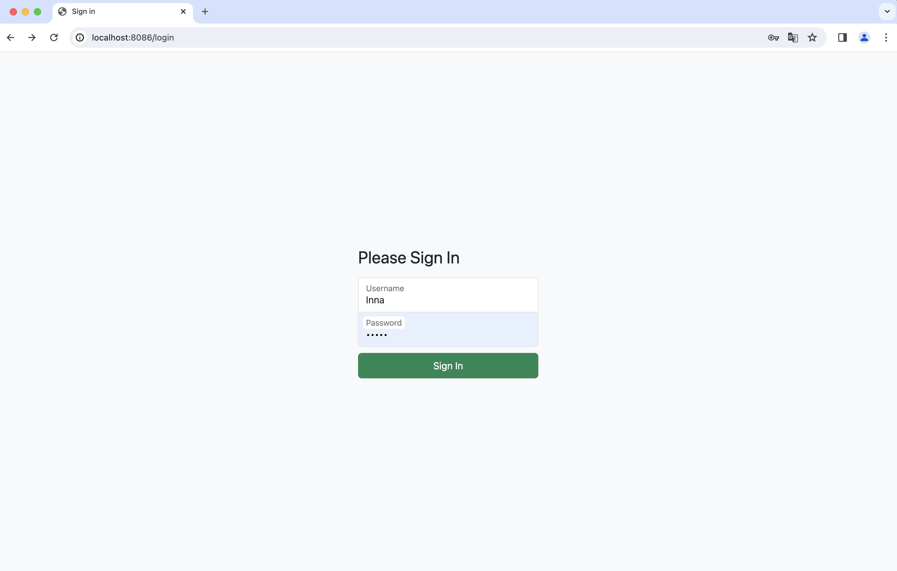
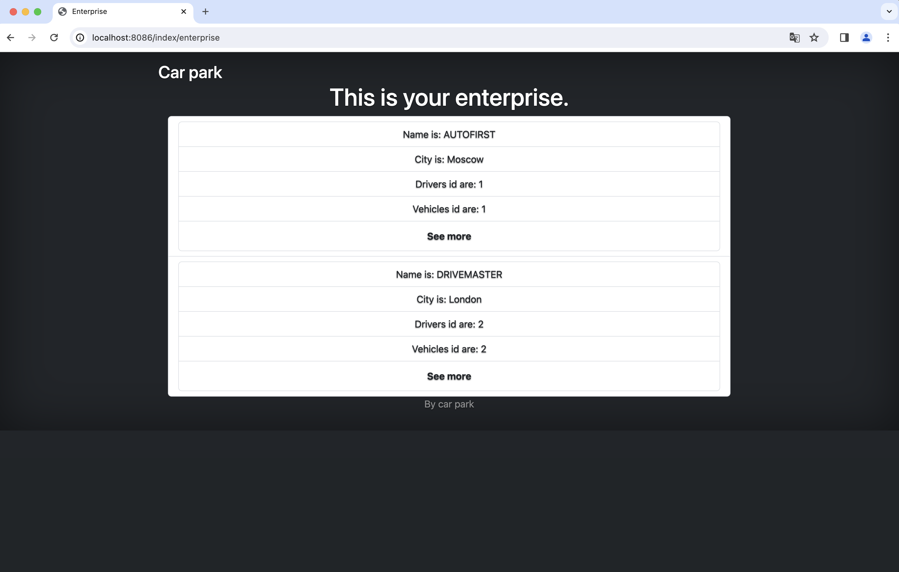
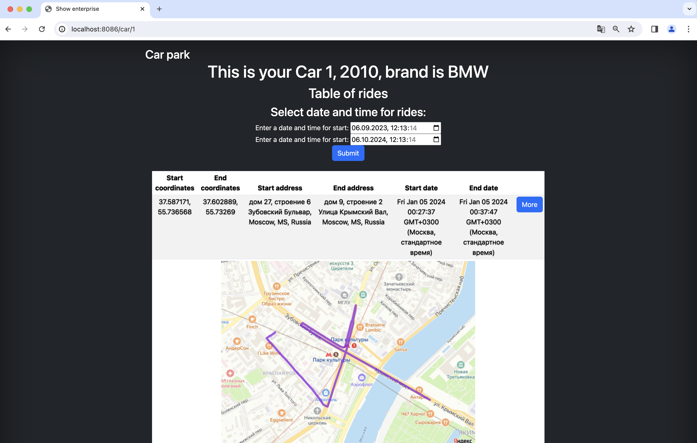

▎Автопарк (Car Park)

▎Описание проекта

Проект "Автопарк" представляет собой систему учёта автомобилей и трекинга. 
Он позволяет менеджерам отслеживать пробег автомобилей, управлять информацией о них и получать сводки через Telegram-бота.

▎Использованные технологии

- Java.
- Maven.
- Spring.
- Kafka.
- PostgreSQL, postgis.
- Grafana, prometheus.

▎Функциональные возможности

- Учёт автомобилей с возможностью добавления, редактирования и удаления записей.
- Трекинг пробега автомобилей с использованием Spring Integration для генерации треков.
- Интеграция с Telegram-ботом, который после логина предоставляет сводку по пробегу автомобиля.

▎Установка и запуск

1. Клонируйте репозиторий:

   git clone https://github.com/Leolasland/car-park 
   cd car-park

2. Установите зависимости:

   mvn clean install

3. Запустите с помощью [docker-compose.yml](docker-compose.yml)

4. Используйте тестового пользователя: 
   Inna, 12345

Логин:

Основная страница с выбором компаний:

Автомобиль с поездкой.

